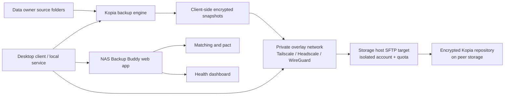

# Reference Architecture

## Goal

Enable homelab users to store encrypted offsite backups on each other's infrastructure without either party seeing plaintext data, and without requiring the data owner to keep a full second encrypted repository beside the source data.

## Architecture Decision

The default v1 architecture is **Kopia direct-to-peer backup over SFTP on a private overlay network**.

Syncthing is no longer the default v1 transport. It remains an optional/future transport for advanced repository mirroring, LAN experiments, or bring-your-own-transport flows, but it creates a large owner-side storage penalty when it replicates a local encrypted repository.

## Architecture Summary

## Why This Pivot

The earlier design wrote encrypted snapshots to a local repository and used Syncthing to replicate that repository to a peer. That is safe, but it often requires the data owner to have close to `source data + encrypted repository` capacity locally. For already-full NAS users, that can be a near-2x storage requirement.

Direct remote repositories avoid that. Kopia encrypts, deduplicates, and compresses locally, then writes encrypted repository data directly to peer-hosted storage. The data owner needs local cache and working space, not a complete second repository copy.

## Components

### Web App

Responsibilities:

- User profiles.
- Storage offered and storage requested.
- Match scoring.
- Backup pact workflow.
- Pairing token exchange.
- Host connection bootstrap metadata.
- Health status and alerts.
- Reputation.
- Incident handling.
- Later: payments and payouts.

The web app must not receive:

- Backup encryption passwords.
- Plaintext file names.
- Plaintext file contents.
- Full local source paths.
- Private keys.
- Raw Kopia, SSH, or SFTP logs.

### Data Owner Client

Responsibilities:

- Select source folders.
- Store backup secrets locally.
- Create or connect a Kopia repository on the matched peer's SFTP target.
- Run scheduled Kopia snapshots.
- Run repository verification with `kopia snapshot verify`.
- Run restore drills and canary checksum checks.
- Report allowlisted operational health metadata.

### Storage Host Client

Responsibilities:

- Create an isolated hosted-storage namespace for a match.
- Expose SFTP only over the private overlay network.
- Enforce quota and path isolation.
- Monitor free space and reachability.
- Report host-side availability and quota health.
- Avoid inspecting, modifying, or deleting encrypted repository data except through an agreed retirement process.

### Backup Engine

Default: Kopia.

Future optional engine: restic.

Responsibilities:

- Client-side encryption.
- Snapshots.
- Retention policy.
- Deduplication.
- Compression where supported.
- Restore.
- Repository verification.
- Remote repository support over SFTP.

### Private Overlay Network

Default direction: support Tailscale first for usability through the desktop client's Peer Connection flow. Headscale and plain WireGuard remain advanced/future paths.

Responsibilities:

- Avoid public inbound ports where possible.
- Provide stable peer addressing despite dynamic IPs.
- Encrypt transport between matched devices.
- Restrict SFTP access to matched peers.

### SFTP Storage Target

Responsibilities:

- Provide a simple remote filesystem target for Kopia.
- Use an isolated account, chroot/jail, container, or equivalent path boundary.
- Apply quota at the filesystem, dataset, container, or account level.
- Log only operational connection events, not file contents or backup secrets.

### Syncthing

Syncthing is not the default v1 data path.

Potential future roles:

- Optional repository mirror for users who can afford local repository storage.
- LAN/local replication helper.
- Storage-host replication between disks.
- Advanced bring-your-own-transport mode.

Syncthing must still never sync live source folders directly to peers.

## Data Flow

1. The web app matches a data owner with a storage host and records the pact.
2. The host client creates an isolated SFTP target and quota for the match.
3. The Peer Connection flow establishes Tailscale reachability and guides host-space or backup-target setup.
4. The owner client stores the backup password locally and creates a Kopia SFTP repository on the host target.
5. Kopia snapshots selected source folders directly to the remote encrypted repository.
6. The owner client runs repository verification and restore drills.
7. The owner and host clients report allowlisted health metadata to the web app.
8. Protected status is allowed only after backup, remote reachability, quota, restore drill, key backup, and telemetry checks pass.

## Trust Boundaries

| Boundary | Trust Assumption | Control |
| --- | --- | --- |
| User device to backup engine | User owns the source data | Local-only encryption keys |
| Backup engine to SFTP target | Network and host are untrusted | Kopia encryption before upload, overlay network, SSH auth |
| Peer storage | Peer may be curious, unreliable, or mistaken | Encryption, quota, health checks, restore drills, host isolation |
| Client to web app | Platform needs metadata only | Redaction and schema allowlist |
| Website users | Users may misrepresent capacity or uptime | Reputation, verification, invite-only alpha |

## Minimum Safe Configuration

- Kopia repository target is remote peer storage over SFTP on a private overlay network.
- Backup password/key material is local-only and backed up by the user.
- Host storage path is isolated from the host's own source data and other matches.
- Host quota is configured before accepting data.
- Source folders are never exposed as network shares to the peer.
- Retention policy is configured.
- At least one restore drill has succeeded from the remote repository.
- Alerts exist for stale backup, remote repository unreachable, quota low, peer offline, and restore failure.

## Future Hardening

- Two-peer backup targets.
- Host-side ZFS/Btrfs snapshots of encrypted repository data.
- Append-only or delayed-delete storage modes.
- S3-compatible host mode with object lock where available.
- restic REST server append-only mode as an alternate engine path.
- Signed health reports.
- Client auto-update strategy.
- Provider escrow or credit staking.
- Storage proof protocol.
- Region-aware matching.
- Disaster recovery mode for fast peer replacement.
