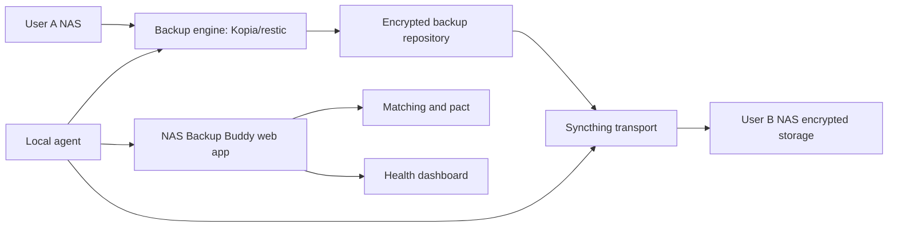

# Reference Architecture

## Goal

Enable two or more homelab users to store encrypted offsite backups on each other's infrastructure without either party seeing plaintext data.

## Architecture Summary

## Components

### Web App

Responsibilities:

- User profiles.
- Storage offered and storage requested.
- Match scoring.
- Backup pact workflow.
- Health status and alerts.
- Reputation.
- Incident handling.
- Later: payments and payouts.

The web app must not receive:

- Backup encryption passwords.
- Plaintext file names.
- Plaintext file contents.
- Private keys.

### Local Agent

Responsibilities:

- Drive backup engine setup.
- Drive Syncthing setup.
- Validate safe folder layout.
- Enforce quota.
- Run backup, sync, and restore checks.
- Report health metadata.

Suggested metadata only:

- Agent version.
- Last backup status and timestamp.
- Last sync status and timestamp.
- Last restore drill status and timestamp.
- Repository size.
- Available quota.
- Peer online/offline state.
- Disk health summary.
- Error category and redacted message.

### Backup Engine

Recommended first choice: Kopia.

Alternative: restic.

Responsibilities:

- Client-side encryption.
- Snapshots.
- Retention policy.
- Deduplication.
- Restore.
- Repository verification.

### Syncthing

Responsibilities:

- Peer-to-peer replication of encrypted repository files.
- Device authentication.
- Discovery.
- Relay fallback.

Syncthing should sync only encrypted backup repository data, not the user's live source folder.

### Discovery And Relay

Start with Syncthing defaults.

Add private discovery and relay when:

- The alpha has repeatable connectivity issues.
- Product requirements need better observability.
- Privacy posture requires reducing public discovery metadata.
- Premium reliability needs platform-owned relay bandwidth.

## Data Flow

1. User selects source folders locally.
2. Backup engine writes encrypted snapshots to a local repository path.
3. Syncthing replicates the encrypted repository path to the matched peer.
4. Peer stores encrypted data under a quota-bound folder.
5. Agent reports operational health to the web app.
6. Restore drill pulls from local or peer copy and verifies canary content.

## Trust Boundaries

| Boundary | Trust Assumption | Control |
| --- | --- | --- |
| User device to backup engine | User owns the source data | Local-only encryption keys |
| Backup repository to peer | Peer is untrusted | Client-side encryption |
| Peer storage | Peer may be curious or unreliable | Encryption, quotas, health checks, multi-peer later |
| Agent to web app | Platform needs metadata only | Redaction and schema allowlist |
| Website users | Users may misrepresent capacity | Reputation, verification, and manual alpha |

## Minimum Safe Configuration

- Backup repository is encrypted before Syncthing sees remote data.
- Live folders are not directly shared with strangers.
- Retention policy is configured.
- Restore password or key material is saved outside the NAS.
- At least one restore drill has succeeded.
- Alerts exist for stale backup, stale sync, disk-full, and peer offline.

## Future Hardening

- Multi-peer replication.
- Erasure coding or repository copy to multiple peers.
- Signed health reports.
- Agent auto-update strategy.
- Provider escrow or credit staking.
- Storage proof protocol.
- Region-aware matching.
- Disaster recovery mode for fast peer replacement.

