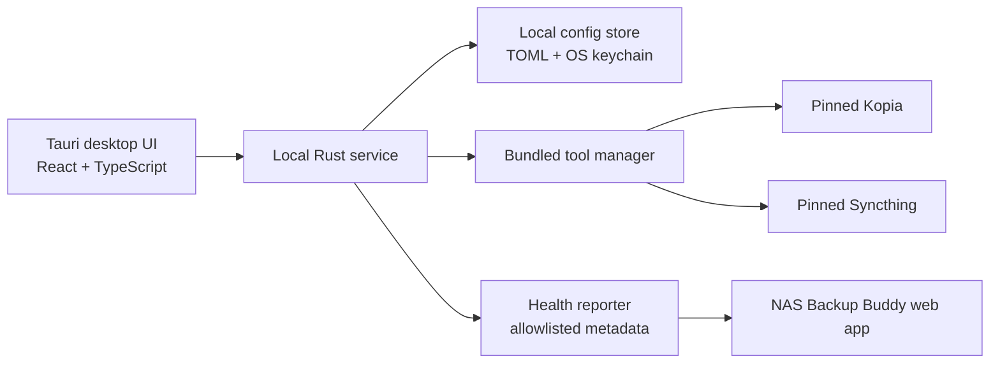
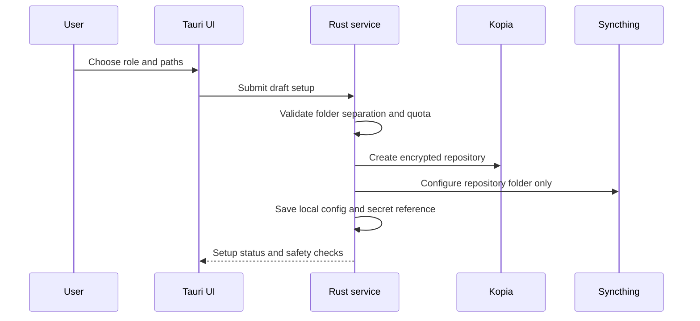
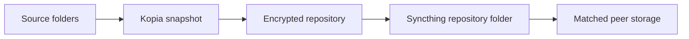
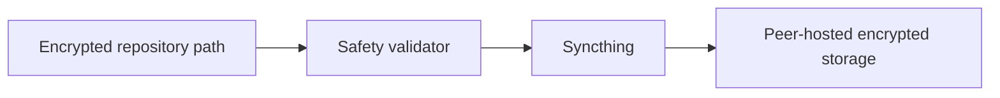
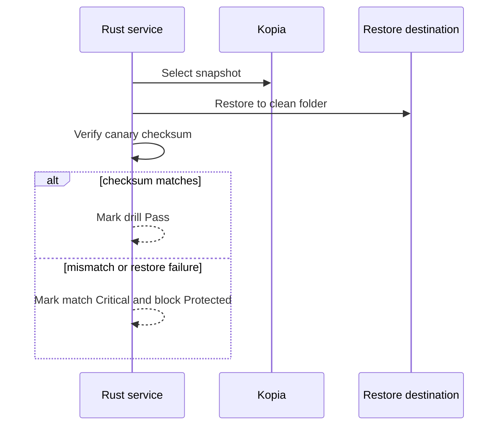
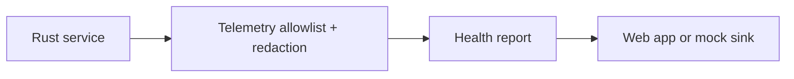

# Client App Architecture

## Overview

The client app is a desktop UI plus a local background service. The UI guides the user. The service performs sensitive and operational work.

## Components

### Tauri Desktop UI

Responsibilities:

- Onboarding wizard.
- Dashboard.
- Backup plan view.
- Syncthing connection view.
- Restore drill view.
- Health checks.
- Redacted logs.
- Settings.
- About/license view.

The UI should never keep raw secrets longer than needed to pass them to the local service. Password and key entry screens must be explicit about local-only handling.

### Local Rust Service

Responsibilities:

- Own config parsing and validation.
- Own secret access through OS keychain where practical.
- Execute Kopia and Syncthing.
- Validate source, repository, and hosted storage folder separation.
- Run backup, repository check, sync check, and restore drill tasks.
- Produce redacted logs.
- Produce allowlisted health reports.

The service is the only component allowed to launch bundled tools.

### Bundled Tool Manager

Responsibilities:

- Store a pinned manifest for supported Kopia and Syncthing versions.
- Verify bundled binary checksums.
- Fail closed when a bundled binary is missing, has a version mismatch, or has a checksum mismatch.
- Expose tool status to the UI.

Restic can be documented as future optional support, but v1 should not make users choose between engines during onboarding unless Kopia cannot run.

### Local Config Store

Responsibilities:

- Store human-readable non-secret configuration as TOML.
- Store secrets in the OS keychain where practical.
- Store only references to secrets in TOML.
- Keep config in the OS-appropriate app data directory.

Examples:

- Windows: application data directory.
- macOS: application support directory plus keychain.
- Linux: XDG config/data directories plus secret service where available.

### Health Reporter

Responsibilities:

- Emit only allowlisted operational metadata.
- Redact error messages.
- Never include source file names, contents, raw paths, passwords, or keys.
- Support mock/offline mode until the web API is real.

### Restore Drill Runner

Responsibilities:

- Select or create canary data.
- Restore to a clean destination.
- Verify expected checksum against observed checksum.
- Record tool versions, snapshot ID, result, duration, warnings, and follow-up.
- Mark failure as Critical.

## Data Flows

### Onboarding

### Backup Creation

The source folders never become Syncthing folders.

### Sync

If the safety validator detects that a source folder is configured for Syncthing replication, sync setup must stop.

### Restore Drill

### Health Reporting

## Trust Boundaries

| Boundary | Rule |
| --- | --- |
| UI to service | UI sends user choices; service validates before saving or executing |
| Service to tools | Service controls tool paths, arguments, environment, and log redaction |
| Service to web app | Only allowlisted operational metadata leaves the machine |
| User source data to repository | Kopia encrypts before peer transport |
| Repository to peer | Syncthing transports encrypted repository data only |

## Protected Status Dependency

The client can display `Protected` only when all gates pass:

- Backup snapshot exists.
- Encrypted repository synced to peer.
- Restore drill completed.
- Canary checksum matches.
- User has confirmed recovery key/password backup.
- Retention policy configured.
- Peer quota has buffer.
- No critical health alerts.

