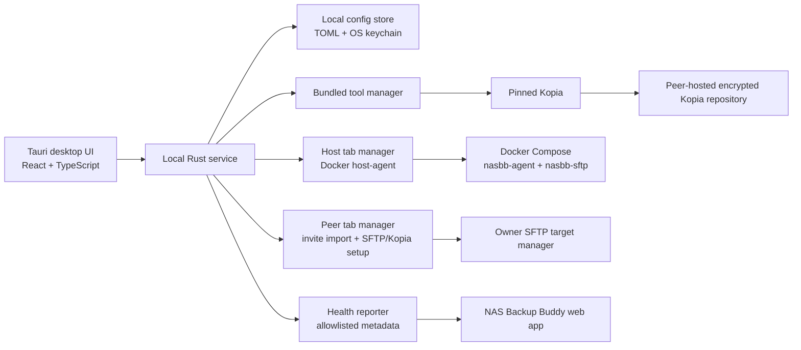
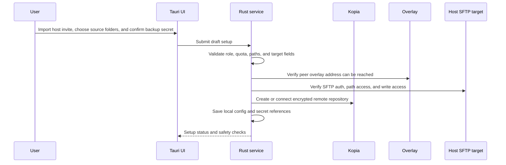
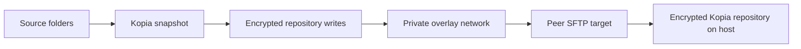
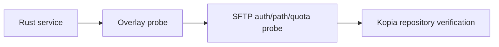
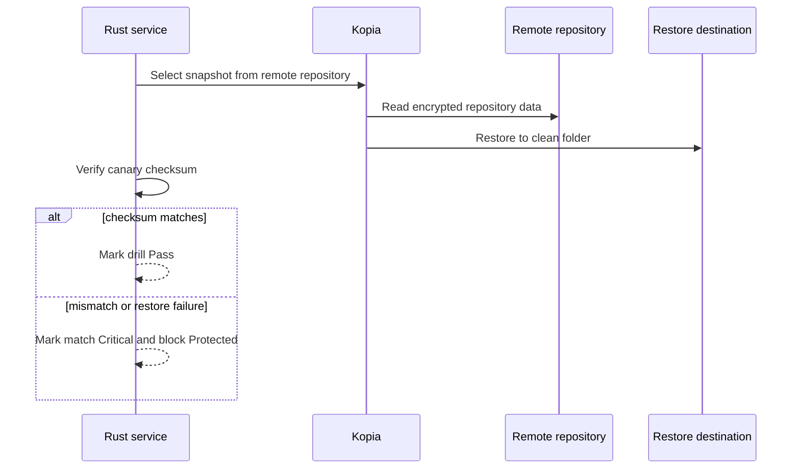
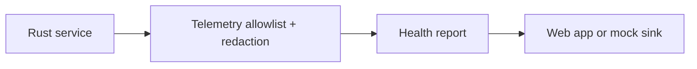

# Client App Architecture

## Overview

The client app is a desktop UI plus a local Rust service. The UI guides the user. The service performs sensitive and operational work.

The default v1 backup path is now **Kopia direct-to-peer over SFTP on a private overlay network**. This avoids requiring the data owner to keep a complete local encrypted repository copy before replication.

Syncthing support remains useful for the existing prototype and possible future mirror mode, but it is not the default v1 transport.

## Components

### Tauri Desktop UI

Responsibilities:

- Onboarding wizard.
- Dashboard.
- Backup plan view.
- Host view for Docker host-agent setup and storage allocations.
- Peer view for data-owner Host Invite Bundle import, Owner Access Response export, SFTP verification, and Kopia repository setup.
- Restore drill view.
- Health checks.
- Redacted logs.
- Settings.
- About/license view.

The UI should never keep raw secrets longer than needed to pass them to the local service. Password and key entry screens must be explicit about local-only handling.

### Local Rust Service

Responsibilities:

- Own config parsing and validation.
- Own secret access through OS keychain where practical.
- Execute Kopia.
- Validate source, remote repository, and hosted storage separation.
- Prepare or inspect host-side SFTP target settings.
- Probe overlay and SFTP reachability.
- Run backup, repository verification, remote target check, and restore drill tasks.
- Produce redacted logs.
- Produce allowlisted health reports.

The service is the only component allowed to launch bundled tools or use backup secrets.

### Bundled Tool Manager

Responsibilities:

- Store a pinned manifest for supported Kopia versions.
- Verify bundled binary checksums.
- Fail closed when a bundled binary is missing, has a version mismatch, or has a checksum mismatch.
- Expose tool status to the UI.

Restic can be documented as future optional support, but v1 should not make users choose between engines during onboarding unless Kopia cannot run.

### Overlay Manager

Responsibilities:

- Detect whether the device is reachable through Tailscale.
- Record the matched peer's overlay address or hostname.
- Feed the Host tab's advertised address/bind recommendations and the Peer tab's reachability checks.
- Avoid public inbound port assumptions.

The first implementation can be manual/instructional, but health checks must eventually distinguish "overlay not configured" from "peer unreachable."

### Docker Host-Agent Manager

Responsibilities:

- Check Docker and Docker Compose prerequisites.
- Read and write `apps/host-agent/compose/.env` without deleting unknown user settings.
- Start, stop, restart, and inspect the `apps/host-agent` Docker Compose stack.
- Connect to the host-agent API at `http://127.0.0.1:7420/api/v1` using a bearer token.
- Create allocations, export Host Invite Bundle JSON, import Owner Access Response JSON, and manage allocation lifecycle.
- Surface host-agent health, SFTP exposure warnings, events, logs, and verification output.

The Host tab is the source of truth for storage-provider setup. Legacy display-only host command plans are not part of the v1 host path.

### Peer SFTP Target Manager

Responsibilities:

- Import and validate a Host Invite Bundle.
- Generate or reference a per-match owner SSH key.
- Export Owner Access Response JSON for the host.
- Verify TCP/SFTP reachability, SSH auth, path access, and write access.
- Create/connect the Kopia repository on the host-agent SFTP target.
- Restore saved invite and connection state after app restart without storing private key material in plaintext config.
- Redact usernames, hosts, paths, and command output where needed.

The host target uses the Docker host-agent's per-allocation SFTP user and chroot boundary.

### Local Config Store

Responsibilities:

- Store human-readable non-secret configuration as TOML.
- Store secrets in the OS keychain where practical.
- Store only references to secrets in TOML.
- Keep config in the OS-appropriate app data directory.

Examples:

- Windows: application data directory.
- macOS: application support directory plus keychain.
- Linux: XDG config/data directories plus secret service where available.

### Health Reporter

Responsibilities:

- Emit only allowlisted operational metadata.
- Redact error messages.
- Never include source file names, contents, raw paths, passwords, SSH keys, or backup keys.
- Support mock/offline mode until the web API is real.

### Restore Drill Runner

Responsibilities:

- Select or create canary data.
- Restore from the remote encrypted repository to a clean local destination.
- Verify expected checksum against observed checksum.
- Record tool versions, snapshot ID, result, duration, warnings, and follow-up.
- Mark failure as Critical.

## Data Flows

### Onboarding

### Backup Creation

The data owner does not need a full local encrypted repository copy in the default v1 path.

### Remote Target Check

If overlay or SFTP reachability fails, backup should not be marked Protected.

### Restore Drill

### Health Reporting

## Trust Boundaries

| Boundary | Rule |
| --- | --- |
| UI to service | UI sends user choices; service validates before saving or executing |
| Service to tools | Service controls tool paths, arguments, environment, and log redaction |
| Service to web app | Only allowlisted operational metadata leaves the machine |
| User source data to repository | Kopia encrypts before network upload |
| Owner to host SFTP target | Host is untrusted; repository data must already be encrypted |
| Overlay network | Overlay improves reachability and transport privacy; it is not the backup encryption boundary |

## Protected Status Dependency

The client can display `Protected` only when all gates pass:

- Backup snapshot exists.
- Remote encrypted repository is reachable.
- Host quota has buffer.
- Restore drill completed.
- Canary checksum matches.
- User has confirmed recovery key/password backup.
- Retention policy configured.
- No critical health alerts.

## Legacy And Optional Syncthing Mode

The current prototype includes Syncthing safety logic. Keep it as a legacy/optional mode until it is intentionally removed or reworked.

Rules for any Syncthing mode:

- It must never sync live source folders.
- It must be clearly labeled as mirror/advanced mode.
- The UI must explain that it can require a local encrypted repository copy.
- It must not be the default v1 path.

## Deprecated UI Surfaces

`Peer Connection`, `Peer Storage`, `Overlay Setup`, and manual `Host Setup` command-plan flows are not the target v1 setup surfaces after the Docker host-agent work. Keep compatibility redirects only as long as needed during migration:

- `/host-setup` should redirect to `/host`.
- `/peer-connection`, `/peer-storage`, and `/overlay` should be removed from primary navigation when `Peer` lands.
- The new `Peer` tab should absorb only the data-owner functionality that is still valid: invite import, owner SSH key/access response, SFTP verification, Kopia repository create/connect, backup run, and next-step guidance.
